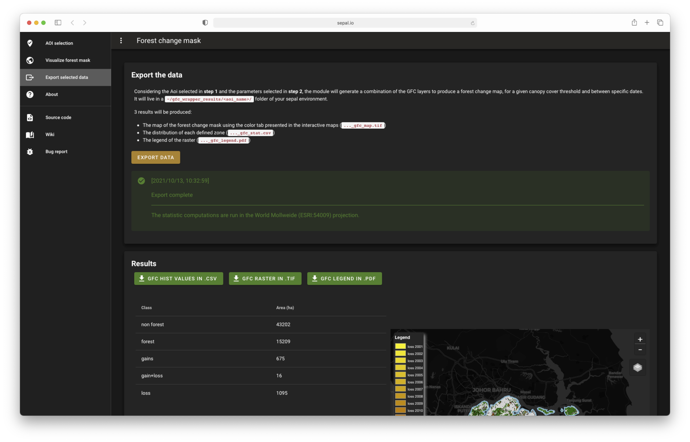

# 3. export selected data 

Considering the Aoi selected in step 1 and the threshold selected in step two the module will generate a combination of the GFC layers to produce a forest change map, for a given canopy cover threshold. It will live in a `~/gfc_wrapper_results` folder of your sepal environment. 

2 results will be produced: 
- the map of the forest change mask using the color tab presented in the interactive maps
- the distribution of each defined zone in a .csv file

You can download these two files directly from the interface using the green buttons

---
[ go to  &rarr; 4. Run MSPA analysis](./mspa_mask.md)  

[return &larr; to 2. GFC visualization](./gfc_viz.md) 