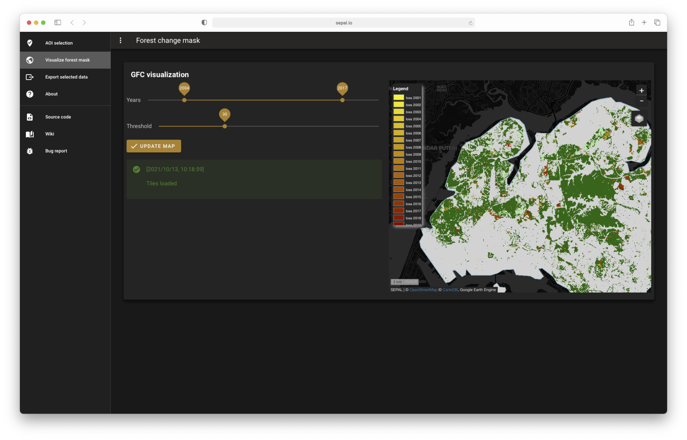

# 2. GFC visualization

Use the slider to change the threshold to consider between forest and non forest areas. Once you've selected a value, ckick on `update map` to update the interactive map layers. 

The new layer is a combination of the GFC layers to produce a forest change map, for a given canopy cover threshold. The legend is displayed in the map. You're allowed to zoom in-out as the data are processed in GEE. 

When changing the value of the threshold, a new layer will be added to the map so you can compare and select the more apropriate value of threshold for your analysis. 

> :warning: The value that will be used for the next step is the last asked value of threshold. If you want to come back to a previous value, move the slider back and click on `update map` again.  
  
  

---
[ go to  &rarr; 3. Export data](./export.md)  

[return &larr; to 2. select AOI](./select_aoi.md) 