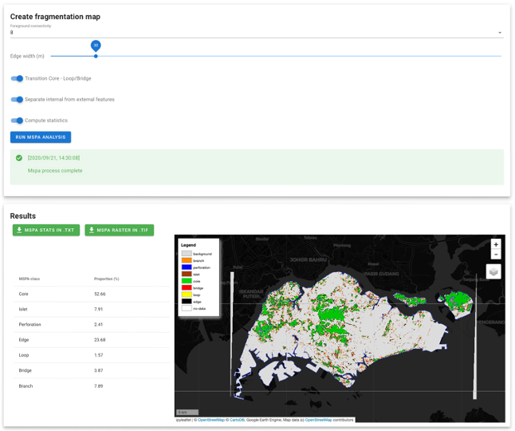

# 4. Run MSPA analysis

## data

Using the image of your last GFC mask the module will create a binary image of the forested areas:
- 0 no-data (outside the aoi borders)
- 1 non-forest
- 2 forest

This will be the base map of the MASP analysis.

Several tuning parameters are then available to the user: 

- Foreground connectivity: the number of neighbours to be considered to define a connexe area (4 or 8)
- Edge width: the width in meter of the edge of an area. steps are based on the images resolution (30m)
- 3 default parameters associated to the definition of islet, perforation loop and bridges ([find more about the MSPA tool](https://forest.jrc.ec.europa.eu/en/activities/lpa/mspa/)).

> :warning: Before launching the process, make sure that your instance is powerful enough to run the process. `m4` is the minimum for country-size computation.

The module will produce a tif map of the fragmentation map and an .txt file of the zonal analysis. The .tif file is displayed on the interactive map and both results can be downloaded using the green buttons.

---
[return &larr; to 3. Export data](./export.md)  

